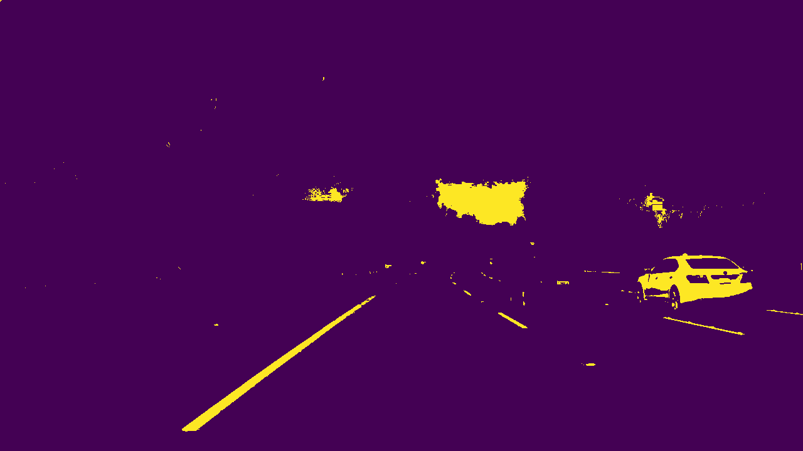
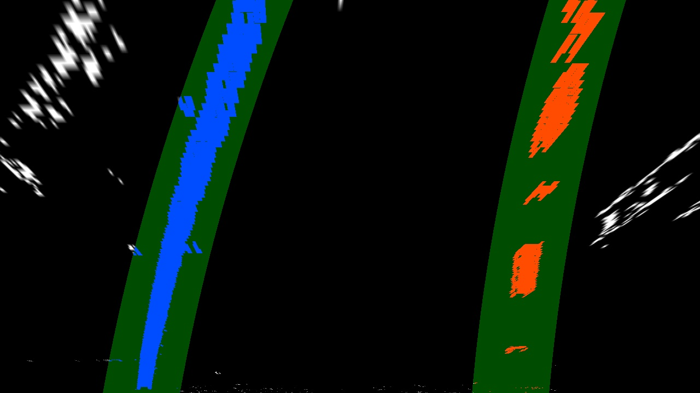
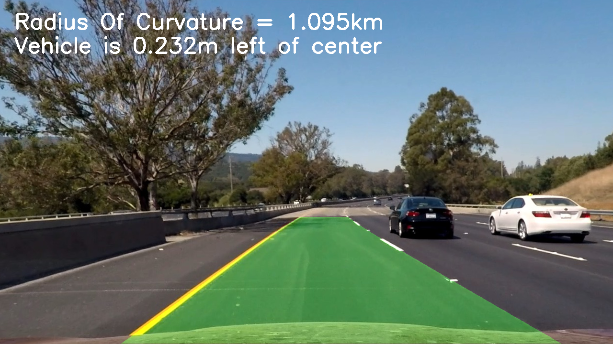

# Advanced Lane Detection using OpenCV and Python

## Overview

This project walks you through some of the advanced concepts in finding lane lines using OpenCV library functions. This project includes passing an image through series of pipeline steps to extract lane information. 

## Steps followed in this project are as follows

* **Camera Calibration:** Compute the camera calibration matrix and distortion coefficients given a set of chessboard images.
* **Distortion Correction:** Apply a distortion correction to raw images.
* **Extract Lane information:** Use color transforms, gradients, etc., to create a thresholded binary image.
* **Perspective Transform:** Apply a perspective transform to rectify binary image ("birds-eye view").
* **Lane detection:** Detect lane pixels and fit to find the lane boundary.
* **Compute Curvature of Lanes:** Determine the curvature of the lane and vehicle position with respect to center.
* **Annotation of Detected Lanes:** Warp the detected lane boundaries back onto the original image.
* **Output Final Image:** Output visual display of the lane boundaries and numerical estimation of lane curvature and vehicle position.


## Camera Calibration

First step is to eliminate any unwanted distortion in the image introduced by the camera. This is very important so as to compute the curvature of the lanes correctly.

I start by preparing "object points", which will be the (x, y, z) coordinates of the chessboard corners in the world. Here I am assuming the chessboard is fixed on the (x, y) plane at z=0, such that the object points are the same for each calibration image.  Thus, `objp` is just a replicated array of coordinates, and `objpoints` will be appended with a copy of it every time I successfully detect all chessboard corners in a test image.  `imgpoints` will be appended with the (x, y) pixel position of each of the corners in the image plane with each successful chessboard detection.  

I then used the output `objpoints` and `imgpoints` to compute the camera calibration and distortion coefficients using the `cv2.calibrateCamera()` function.  I applied this distortion correction to the test image using the `cv2.undistort()` function and obtained this result: 

Here's is the output of distortion correction

<p align="center">
  
</p>


## Pipeline Stages

### 1. Distortion Correction

Use the camera matrix and and distortion coefficients computed in above step to undistort images. Following is the one example of distortion corrected image.

<p align="center">
  
</p>


### 2. Gradients and Color Threshold

#### Gradient Threshold

The undistorted image is then passed through function `apply_grad_thresholds()` to apply gradients in x and y direction and also compute magnitude gradients separately and then combine these images.

Here is the output image after applying gradients
<p align="center">
  
</p>

#### Color Threshold

Universally the lane lines on the road are marked in **_White_** and **_Yellow_**, and after trying with different color spaces found out that the colors Yellow and White are more prominent in **_HSL(Hue Saturation and Light)_** color space.

Here are the filter values which worked best for me
##### Filtering White Lines
From the above model you can easily observe that white colors are present at the top of the cylinder, i.e. higher Lightness value regardless of Hue and Saturation.
    
    Hue:        no-filter
    Lightness:  195 to 255
    Saturation: no-filter

##### Filtering Yellow Lines

    Hue:        18 to 32
    Lightness:  120 to 255
    Saturation: 90 to 255

Here is the output of `apply_color_thresholds()`
<p align="center">
  
</p>

##### Combining the two threshold images we get

<p align="center">
    
</p>


### 3. Perspective Transform

The function `warp_image()` takes binary threshold image and creates the warped image.

The `warp_image()` function takes as inputs an image (`img`), as well as source (`src`) and destination (`dst`) points.  I chose the hardcode the source and destination points in the following manner:

```python
    src = np.float32(
            [[586, 454], 
            [698, 454], 
            [272, 674], 
            [1054, 674]])
    
    dst = np.float32(
            [[225, 0], 
            [900, 0], 
            [225, 702], 
            [900, 702]])
```

After applying perspective transform on test images we get the following output

<p align="center">
  
</p>

<p align="center">
  
</p>

### 4. Identify Lane Pixels

The sliding window technique is used to identify the lane pixels in the `warped_bianry` image. The function `sliding_window()` takes binary warped image and finds the pixels belong to left and right lanes. The these pixels are used to fit a second order polynomial equation. This equation best fits our lanes.

THe sliding window is used for the first frame, and once we have got the first lane fitting curves, we can simply search around the previous lanes for pixels in the current frame. So the function `search_around_poly()` takes in previous lane equations and tries to find the lanes pixels in the current image.

Here is the visualization of `sliding_window()` and `search_around_poly()` functions

<p align="center">
    
</p>

<p align="center">
    
</p>

### 5. Compute Radii of Curvature

The function `measure_curvature_pixels()` takes in the (x, y) co-ordinates of the detected lane and then computes the radii pixels. Then this radii is converted from pixels to 'km' using following scale

    ym_per_pix = 30/720 # meters per pixel in y dimension
    xm_per_pix = 3.7/700 # meters per pixel in x dimension


### 6. Display final image

The detected lanes are perspective transformed back onto the original image, and the detected lane area is highlighted in green color.

Also, the computed radii of curvature is displayed on the upper left corener of the frame. These steps taken care by the function `draw_on_original()`

Here is the final output

<p align="center">
    
</p>
---

## Pipeline Run on Video
After running the pipeline on videos, we can see the lanes are accurately detected in the project video.

Here's a [link to my video result](https://github.com/Vinod-Koli/CarND-Advanced-Lane-Lines/blob/master/output_project_video.mp4)

---

### Future Improvements

##### 1. This pipeline needs to updated on in Thresholding step to improve the accuracy of lane detection in difficult scenarios.

There is possibility that `apply_grad_thresholds()` function might detect the lane-like edges which are actually not the lanes. So adding some more filters to remove edges which does not belong to lanes is a tricky part and I would love to solve this challenge during free time.

There are ofcourse possibilties of more improvements.

