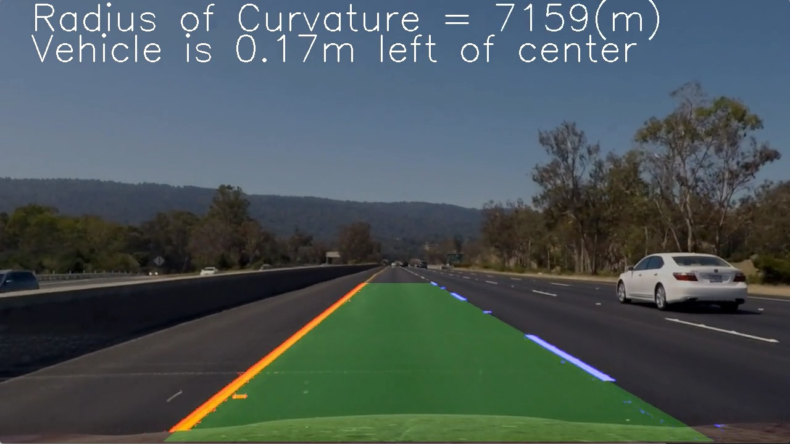

## Advanced Lane Finding
 

### Instructions

The project is written in `Python` using `Jupyter Notebook`. 

The projects incudes various pipeline steps as described in `Project_Writeup`.

Please refer to `Advanced_Lane_Detection.ipynb` for the code. This file is self explainatory which walks you through every step with visualization of output images at every step.

The test images for the pipeline are stored in the folder `test_images` and the output images after every pipeline step are stored in `output_images` folder.

The final pipeline is run on the `project_video` and the new processed video is created named `output_project_Video`.
